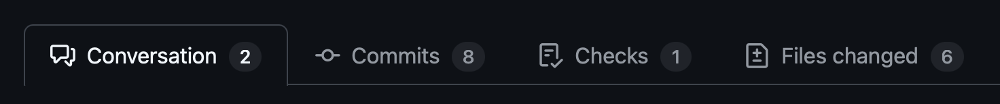

?> This documentation primarily applies to reviews for the [Poseidon Community Archive](archive_overview).

# Reviewing packages

The role of the Poseidon package reviewer is to help ensuring quality standards for Poseidon's public package archives. Fortunately, many aspects of the Poseidon schema are machine-testable. Automatic validation catches various structural issues right away, for example missing mandatory columns in the Poseidon .janno file (such as the `Poseidon_ID`).

But there are some aspects we cannot check, such as the scientific correctness of the given information. And there are other we don't want to formally check, because they are not included in the core definition of a Poseidon package, but just policy for our public archives. For these, we rely on a checklist every package author has to fill, and finally manual reviews.

## GitHub Pull Requests

Reviewing for Poseidon happens on GitHub. Generally you will be invited to review a Pull Request, which you can think of as a stage on which all proposed changes are displayed and listed in a way that let's anybody with a GitHub account comment. To review it is therefore not necessary to be part of a special reviewer team. But for the sake of transparency, to give credit, and to make it easier to find reviewers as an editor, we have established one [here](https://github.com/orgs/poseidon-framework/teams/poseidon-package-reviewers). If you agree to review, you will be invited to join this group.

A pull request has four tabs, of which two are relevant:

1. The <kbd>Conversation</kbd> tab lists a description of the Pull Request and any correspondence/discussion that has already happend on it. Note that the first entry in the conversation comes from the person who opened the Pull Request, so the submitter of the Pull Request. Feel free to add to the discussion anything that you might want to contribute as a reviewer, such as lists of suggestions, questions, requests for clarifications, or even things like "Interesting package, I'll be reviewing it next week".

!> When commenting as a reviewer it is especially important to be polite and constructive. Our [code of conduct](conduct) also applies to communication on GitHub.

2. The <kbd>Files changed</kbd> tab lists all files that are to be changed or added in this Pull Request. This is your main place for review. Files that are not too large can be viewed right on GitHub, by simply clicking on the files. Others may be too large to view in the browser. In this case you can download them, by first clicking on the menu with the three dots on the top right of a file, and selecting <kbd>View File</kbd>. You will then see a button to download the file in the new view again on the top right of the file. 

## What to look for?

The following sections highlight some files and specific details you should look for in your review. This is not comprehensive, though. A good point of view to assume for a review is to imagine you would want to use the respective Poseidon package yourself. In what state would you want the data to be, ideally?

Also consider that the community-archive is supposed to mirror closely how the data was presented in the original publication. For a good review it may be necessary at times to go back to the original publication (and its supplementary material) and to verify information.

### The package title

Every package should have a meaningful title following the archive's naming policy: `<Year>_<Last name of first author>_<Region, time period or special feature of the paper>`. Especially the last point tends to be challenging for package authors. As a reviewer you can make a recommendation, if you think the chosen title is not ideal. Every file in the package (except POSEIDON.yml, README and CHANGELOG) should have the package's name (with different file extensions).

### The POSEIDON.yml file

Look at the POSEIDON.yml file and make sure that it is reasonably complete and [most fields](https://www.poseidon-adna.org/#/standard?id=the-poseidon-package) are filled. 

Based on past experience the following questions need special reviewer attention:

- Is the `poseidonVersion` field set to the [latest release](https://github.com/poseidon-framework/poseidon-schema/releases) version of the Poseidon schema?
- Is the `description` reasonably informative? Using the title of the packaged paper is acceptable, but a sentence about the individuals/samples contained in the package is even better.
- Is the `contributor` field filled, so that the package author could be contacted in the future?
- Are the file checksums for genotype data, .janno, and .bib file listed?

### The CHANGELOG file

The CHANGELOG file documents the history of a package. For a new package (version `1.0.0`) a changelog is not necessary, so the file can be omitted.

- Does the latest entry of the changelog correspond to the `packageVersion` as documented in the POSEIDON.yml file?
- Is the latest entry reasonably informative about what was done to the package in the current Pull Request?

### The .bib file

The bibliography file contains information for the publication(s) that published the packaged samples.

- Are all relevant publications listed? Every sample in the .janno file must be linked to at least one publication through the `Publication` column, but sometimes multiple publications are relevant for a Poseidon package. The .bib file can include publications not mentioned in the .janno file.
- Does every bibtex entry contain a title, the journal, the authors, a doi, a month (!) and the year of publication?
- Is the file easily readable, so is the layout reasonable?

### The .janno file

Looking at the .janno file is easiest if you download the file, as described above, and open it in a text editor (for example, Visual Studio Code with the Rainbow CSV extension), or in a Spreadsheet application like Libre Office or MS Excel (for this you may need to use a trick: Modify the filename and add a `.tsv` to the end, then these tools can more easily open and display them in table form).

The file does not have to be complete in the sense that every column specified in the Poseidon schema must be present. But the columns that are there should be filled for every sample for which they apply. And certain high-priority fields, like the [location](https://www.poseidon-adna.org/#/janno_details?id=spatial-position) and [dating](https://www.poseidon-adna.org/#/janno_details?id=temporal-position) of samples, should ideally be there.

- Does the file have obvious errors, like shifted columns, or unreadable characters? Unreadable characters are often the result of wrong character encoding. This happens, for example, when the package author copy-and-pasted from a localized supplementary material file. All characters in .janno files must be UTF-8 encoded.
- Are the primary group/population names in `Group_Name` as in the original publication? `Group_Name` is a `;`-separated list column, so alternative names (e.g. from the AADR) can be given as well, just not in the first position.
- Are the relationship columns symmetrical, so is a relationship between the samples A and B listed for both samples?
- Do numerical columns, e.g. latitude/longitude coordinates, show an odd pattern of incrementally increasing last digits? This often happens when package authors used a spreadsheet program to compile the .janno file.
- Is the dating information correctly given? The `Date_Type` `C14` only applies, if the respective radiocarbon date gives a direct estimate of an individuals year of death, and if the uncalibrated age is known and available.
- Is the location and dating information correct and as published? Exactly here, where they may have catastrophic consequences, typos tend to happen.
- Does every sample have an entry in the `Publication` column?
- Do semantically identical entities, e.g archaeological sites, a consistent, identical name within the package? Slightly different spelling of the same entitiy should be avoided.
- Are idiosyncrasies of a given package for certain variables (if there are any) pointed out in helpful `_Note` columns?
- Have all empty columns been removed? A column with only `n/a` does not add anything to the package and can be removed.

