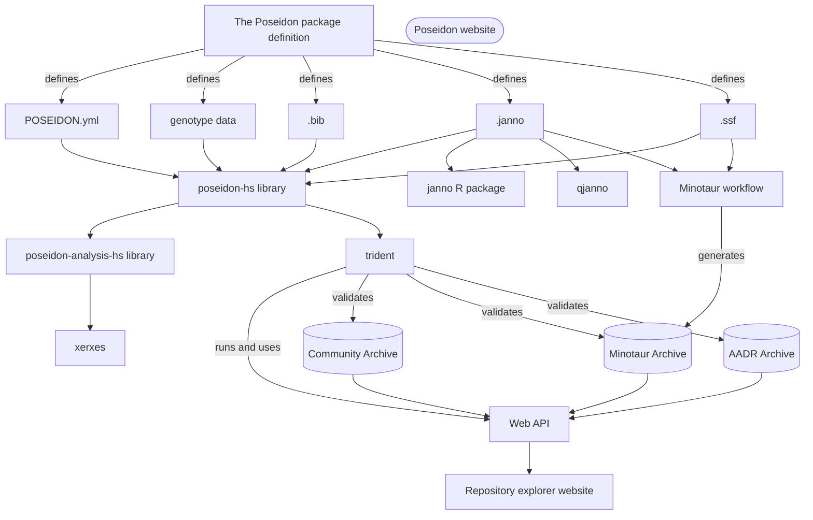

# Developer notes

The Poseidon framework is an entangled system of integrated software solutions. Changes in one part of the framework often have consequences for others. Especially changes to the most central component, the Poseidon standard, can have far-reaching ramifications.

New features or changes to the schema must be implemented in workable Pull Requests, and parallel Pull Requests should be opened in all derived repositories.

This includes the Poseidon website, which documents all components of the framework and thus most certainly requires an update if anything is changed.
