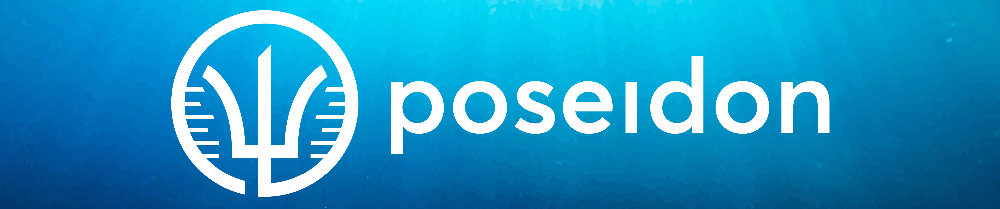

<b>Poseidon is a framework to work with human aDNA data and its archaeological context information.</b>

  

    <button onclick="window.open(
      '#/background',
      '_blank');;"
      class="button">
      
        <i class="fa fa-question-circle" aria-hidden="true"></i> Why?
      
    </button>
    <button onclick="window.open(
      '#/getting_started',
      '_blank');;"
      class="button">
      
        <i class="fa fa-play-circle" aria-hidden="true"></i> Quick start guide
      
    </button>
    &nbsp;
    <button onclick="window.open(
      'https://join.slack.com/t/poseidon-8el7276/shared_invite/zt-14q2wxxmf-pbtNtm5E9DFJbjioyfAyMg',
      '_blank');;"
      class="button">
      
        <i class="fab fa-slack" aria-hidden="true"></i> Slack
      
    </button>
    <button onclick="window.open(
      'https://github.com/poseidon-framework',
      '_blank');;"
      class="button">
      
        <i class="fab fa-github" aria-hidden="true"></i> GitHub
      
    </button>
    <button onclick="window.open(
      'https://ecoevo.social/@poseidon',
      '_blank');;"
      class="button">
      
        <i class="fab fa-mastodon" aria-hidden="true"></i> Mastodon
      
    </button>
  

 

  

    
<i class="fas fa-clipboard-list" aria-hidden="true"></i>

    Poseidon provides a standardized <b>package format</b> for genotype and context data
    <ul>
      <li>The Poseidon <a href="#standard">package standard</a></li>
      <li>How we define and store <a href="#genotype_data">genotype data</a></li>
      <li>How we include context data in the <a href="#janno_details">.janno file</a></li>
      <li>How we reference raw sequencing data with the <a href="#ssf_details">.ssf file</a></li>
    </ul> 
  

  

    
<i class="fas fa-tools" aria-hidden="true"></i>

    Poseidon includes <b>software tools</b> to work with Poseidon packages
    <ul>
      <li>The <a href="#trident">trident</a> CLI software for data management</li>
      <li>The <a href="#xerxes">xerxes</a> CLI software for data analysis</li>
      <li>The <a href="#qjanno">qjanno</a> CLI software for querying .janno files with SQL statements</li>
      <li>The <a href="#janno_r_package">janno</a> package for handling .janno files in R</li>
    </ul>
  

  

    
<i class="fas fa-download" aria-hidden="true"></i>

    Poseidon features publicly hosted and curated <b>package archives</b> of published data
    <ul>
      <li>A <a href="#archive_overview">guide</a> explains the repositories</li>
      <li>And how to <a href="#archive_submission_guide">contribute data</a></li>
      <li>Our server software provides an open <a href="#web_api">Web-API</a> to access packages</li>
      <li style="color: #7CFC00">Which enables an <a href="https://poseidon-framework.github.io/community-archive">overview and download</a> page to browse the archives</li>
    </ul>
  

 

  

    

      

        
<i class="fab fa-mastodon" aria-hidden="true"></i> {{toot.date}}

        
<a :href=toot.link> {{toot.link}}</a>

        

      

    

  

  
  
<i>..fetching data from ecoevo.social</i>

