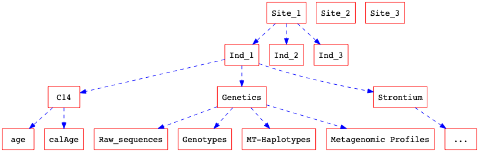
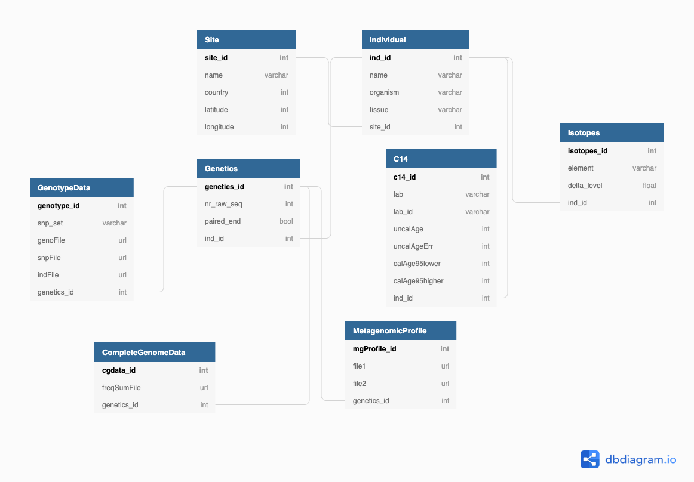

This page is under development

<!-- ---
title: Home
---

# Poseidon Framework - Draft

## Introduction
Archaeogenetics (or, more broader, molecular archaeology -- is that a thing?) has become a fast accelerating field, with new data coming out faster than people can co-analyze. Together with samples currently being processed in the world's largest laboratories, we're now approaching genome-wide data for 10,000 ancient individuals, combining unpublished and published data. In addition, emergent fields such as ancient metagenomics and paleo-proteomics are adding complexity to a scene that already hosts data from long-established non-genetic technologies like radio-carbon dating and stable isotope analyses.

The way data is currently shared and published via academic papers, at least from genetic analyses, is mainly via releasing raw sequencing data into public repositories such as the [ENA](https://www.ebi.ac.uk/ena), while providing partial metadata on samples via poorly formatted Excel tables in the Supplement.

This creates (at least) the following problems:
1. Intermediate data such as genotypes or metagenomic profiles are often not released at all, making it hard for others to reproduce analyses. 
2. The connection between individuals, contextual information, and genetic data becomes hard to maintain, bridging between very different repositories and sources (Excel vs. personal homepages vs. public repositories)
4. Meta-analyses spanning datasets require enormous amounts of work on data collection and curation (the Reich team has done an [admirable job](https://reich.hms.harvard.edu/downloadable-genotypes-present-day-and-ancient-dna-data-compiled-published-papers) on that front, but it's hard to maintain this in such a centralized way within one lab.
5. Studies that combine data from different technologies (isotopes, C14 dating, genetics) have no clear way to release such complex relationships in a concise way.
6. Incrementally produced data, for example by adding new data to  previously published individuals, cannot be easily connected to the same individuals.

All in all, data in the field certainly doesn't -- even remotely -- satisfy the [FAIR principles](https://en.wikipedia.org/wiki/FAIR_data) of open data: Findability, Accessibility, Interoperability, Reproducibility.

---

**Poseidon** is a framework that seeks to provide standardized ways to store and share archaeogenetic, and perhaps more broadly, molecular archaeological datasets.

It consists of three main components:
1. A simple __multi-file format__ to store and share data
2. A set of __tools and APIs__ to join, subset and analyze poseidon-formatted datasets
3. (longer term) A __reference catalogue__ of all publicly available poseidon datasets.

> In the following, we use the term _archaeogenetic_ to refer not just to genetic data, but also to isotope, Radio-Carbon and ancient proteomic data. In short, all _individual-based_ (human or non-human) data that Science can contribute to archaeological remains. [Stephan]

## Multi-file format
### Data Model
Most generally, archaeogenetic data follows a clean hierarchical structure. At the top level, we have an archaeological **site**. Then, for each site, we have **individual remains** from that site. For each remain, we have **analyses** being done, and for each analysis, we have **results**:



This hierarchical scheme lends itself to a classical relational data model with one-to-many relationships:



> Of course, this is just a mockup, there are many aspects which are more complicated. For example, datasets also have a reference to a publications-table, which is not included here. And the parameters in each table are not exhaustive yet. [Stephan]

### Package Structure

### Metadata files

<!-- How can we express such a system of relationships between tables? The standard answer would be "with an sqlite database" or something like that. However, that brings along its own problems. First, it's difficult to check for us whether the format of that db exactly conforms with our schemas. Second, it would be a closed file format that is difficult to edit for humans.

There is a better way. We already have a become accustomed for sharing tabular data: CSV, i.e. comma-separated value files. We already use that file format quite a lot, and it's also, for example, used by David Reich in his "anno" files.

However, while being very simple, CSV is also very poorly formatted. There is no way to enforce a given schema, the datatypes are arbitrary, and there is no standard way to define relationships between tables.

CSV on the web (CSVW) is a convention recommended by the World Wide Web Consortium (W3C), for how to share tabular data across the web ([here](https://www.w3.org/TR/tabular-data-primer/) is a primer and [here](https://www.w3.org/TR/tabular-metadata/) the full definitions). The basic idea is to supplement a CSV file with a metadata file that describes its schema and stores critical meta-information about the data, such as its publisher, a last-modified-date, and most importantly the column names and datatypes.

Let's say we have two CSV files. First, a file called `sites.csv`:

```csv
site_id,name,country,latitude,longitude
SUT,Sutherland,South Africa,-32.40,20.67
FAR,Faraoskop,South Africa,-32.13,18.62
```
and a second file called `individuals.csv`:

```csv
ind_id,name,organism,tissue,site_id
SUT001,"Burial 1, Sk 1",human,tooth,SUT
SUT002,"Burial 2, Sk 1",human,"petrous bone",SUT
FAR001,"Burial 10, Sk 7",human,femur,FAR
```

We can then annotate according to CSVW by adding a file called `metadata.json`, or, as I would suggest in our case perhaps `poseidon-metadata.json`:

```json=
{
    "@context": "http://www.w3.org/ns/csvw",
    "tables": [
        {
            "url": "sites.csv"
            "tableSchema" : {
                "columns": [
                    {
                        "name" : "site_id"
                    },
                    {
                        "name" : "country",
                    },
                    {
                        "name" : "latitude",
                        "datatype" : "number"
                    },
                    {
                        "name" : "longitude",
                        "datatype" : "number"
                    }
                ],
                "primaryKey" : "site_id"
            }
      }, {
        "url": "individuals.csv"
    }]
}
```
 -->
