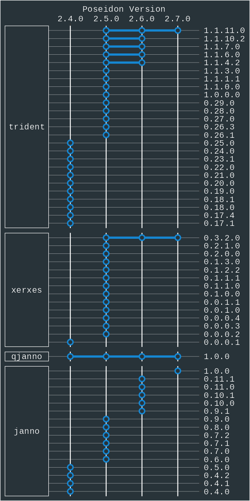

# Version overview table

The following figure documents which versions of the Poseidon standard are compatible with which versions of the software tools. Newer versions of `trident` can generally still read older packages, when no [breaking changes](changelog.md) were introduced.

There is no documented version history before Poseidon v2.4.0.
